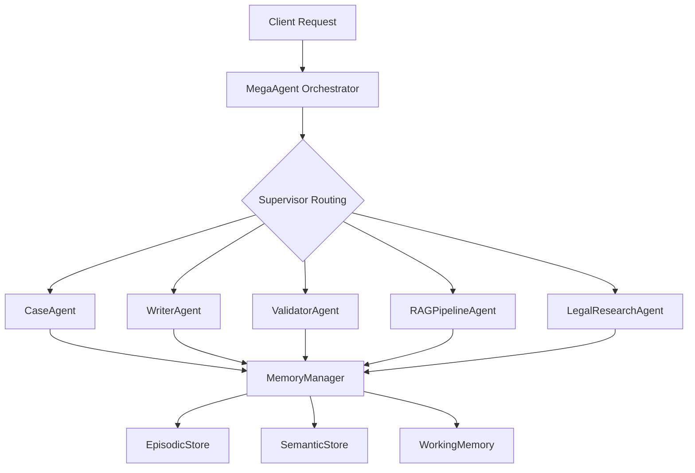

# README для агентов Claude Flow - mega_agent_pro

## 📋 БАЗОВАЯ ИНФОРМАЦИЯ

**Проект**: mega_agent_pro - Advanced Multi-Agent System для юридической сферы
**Тип**: LangGraph/LangChain на основе асинхронного Python
**Статус**: 🚧 В разработке (базовая memory система готова)
**Технологии**: Python 3.11+, LangGraph, Pydantic v2, PostgreSQL, Redis
**База данных**: PostgreSQL (для checkpointing), In-memory stores (для development)
**Деплойтмент**: Docker + Kubernetes (планируется)

## 🏗️ АРХИТЕКТУРА

### Общая схема проекта


### Ключевые компоненты

**1. Memory System (ГОТОВО)**
- `MemoryManager` - Фасад для всех типов памяти
- `EpisodicStore` - Хранение событий и аудита
- `SemanticStore` - Семантическое хранение фактов
- `WorkingMemory` - RMT буфер для контекста

**2. Orchestration Layer (БАЗОВОЕ)**
- `WorkflowState` - Состояние LangGraph workflow
- `pipeline_manager` - Управление checkpointing
- `workflow_graph` - Простой граф: log→reflect→retrieve→rmt

**3. Agents (ПЛАНИРУЕТСЯ)**
- `MegaAgent` - Центральный оркестратор
- `SupervisorAgent` - Динамическая маршрутизация
- Специализированные агенты по спецификации

### Паттерны проектирования
- **Memory Pattern**: Трехуровневая система памяти (эпизодическая, семантическая, рабочая)
- **StateGraph Pattern**: LangGraph workflow с checkpointing
- **Facade Pattern**: MemoryManager как единая точка доступа
- **Protocol Pattern**: Embedder interface для гибкости

## 📁 ФАЙЛОВАЯ СТРУКТУРА

```
mega_agent_pro_codex_handoff/
├── app_demo.py                    # 🟢 Демо приложение (готово)
├── codex_spec.json               # 🟢 Спецификация системы
├── enhanced_codex_spec.json      # 🟢 Расширенная спецификация
├── core/
│   ├── memory/                   # 🟢 Система памяти (готова)
│   │   ├── memory_manager.py     # Главный фасад
│   │   ├── models.py             # Pydantic модели
│   │   ├── stores/               # Хранилища данных
│   │   │   ├── episodic_store.py
│   │   │   ├── semantic_store.py
│   │   │   └── working_memory.py
│   │   ├── policies/             # Политики обработки
│   │   │   └── reflection.py
│   │   └── rmt/                  # RMT buffer система
│   │       └── buffer.py
│   └── orchestration/            # 🟡 Базовая оркестрация
│       ├── pipeline_manager.py   # Управление pipeline
│       └── workflow_graph.py     # LangGraph workflow
├── LANGGRAPH_MIGRATION_GUIDE.md  # 🟢 Руководство по миграции
├── IMPLEMENTATION_CHECKLIST.md   # 🟢 Чеклист реализации
├── LANGGRAPH_ARCHITECTURE_PATTERNS.md # 🟢 Архитектурные паттерны
└── README-AGENT.md               # 🟢 Этот файл
```

**Легенда:**
- 🟢 **Готово** - Можно использовать
- 🟡 **Базовое** - Работает, но требует расширения
- 🔴 **Не реализовано** - Только в спецификации

## 📊 ТЕКУЩЕЕ СОСТОЯНИЕ

### ✅ ЧТО УЖЕ РЕАЛИЗОВАНО

**Memory System (100%)**
- ✅ MemoryManager с полным API
- ✅ EpisodicStore для аудита событий
- ✅ SemanticStore для фактов (with embeddings support)
- ✅ WorkingMemory для RMT буфера
- ✅ Reflection policies для извлечения фактов
- ✅ Pydantic v2 модели данных

**Basic Orchestration (60%)**
- ✅ LangGraph StateGraph integration
- ✅ PostgreSQL/SQLite checkpointing
- ✅ Простой workflow: log→reflect→retrieve→rmt
- ✅ WorkflowState с error handling

**Documentation (90%)**
- ✅ Полная техническая спецификация
- ✅ LangGraph migration guide
- ✅ Архитектурные паттерны
- ✅ Implementation checklist

### 🚧 ЧТО В ПРОЦЕССЕ

**Enhanced Workflows**
- 🚧 Supervisor Pattern реализация
- 🚧 Conditional routing логика
- 🚧 Fan-out/Fan-in patterns
- 🚧 Error recovery mechanisms

### ❌ ЧТО ЕЩЕ НУЖНО СДЕЛАТЬ

**Core Agents (0%)**
- ❌ MegaAgent orchestrator
- ❌ CaseAgent для управления делами
- ❌ WriterAgent для генерации документов
- ❌ ValidatorAgent с self-correction
- ❌ RAGPipelineAgent для поиска
- ❌ LegalResearchAgent

**Advanced Features (0%)**
- ❌ Hybrid RAG система
- ❌ Context Engineering
- ❌ Self-correcting agents
- ❌ Human-in-the-loop workflows
- ❌ Security middleware (RBAC, audit)
- ❌ Performance optimization

**Infrastructure (0%)**
- ❌ Docker containerization
- ❌ Kubernetes deployment
- ❌ Monitoring и alerting
- ❌ CI/CD pipeline

### 🐛 ИЗВЕСТНЫЕ ПРОБЛЕМЫ

1. **LangGraph Dependency**: Требует установки `pip install langgraph`
2. **Embeddings**: Базовая заглушка, нужна интеграция с Gemini/OpenAI
3. **Error Handling**: Минимальная обработка ошибок
4. **Testing**: Отсутствуют unit и integration тесты
5. **Production Config**: Только development конфигурация

## 🎯 СТАНДАРТЫ КОДА

### Стиль кодирования
```python
# Используется throughout:
from __future__ import annotations  # Для forward references

# Async-first подход
async def amethod_name(self, param: str) -> ReturnType:
    """Все методы ввода-вывода асинхронные"""
    pass

# Pydantic v2 стандарт
class Model(BaseModel):
    field: str = Field(..., description="Always provide descriptions")
```

### Naming Conventions
- **Classes**: PascalCase (`MemoryManager`, `WorkflowState`)
- **Methods**: snake_case с префиксом `a` для async (`alog_audit`, `aretrieve`)
- **Constants**: UPPER_SNAKE_CASE
- **Files**: snake_case (`memory_manager.py`, `workflow_graph.py`)

### Комментарии и документация
- Docstrings для всех public методов
- Type hints обязательны
- `# pragma: no cover` для import guards
- Inline комментарии для complex logic

### Тестирование (ПЛАНИРУЕТСЯ)
- pytest + pytest-asyncio
- Mocking для внешних зависимостей
- Contract tests для agent interfaces
- Integration tests для workflows

## 🚀 QUICK START для агентов

### 1. Понимание базовой системы
```python
# Изучить main workflow
python app_demo.py

# Изучить API памяти
from core.memory.memory_manager import MemoryManager
memory = MemoryManager()
```

### 2. Расширение workflow
```python
# Добавить новый узел в workflow_graph.py
async def node_my_feature(state: WorkflowState) -> WorkflowState:
    # Твоя логика
    return state

# Зарегистрировать в build_memory_workflow()
graph.add_node("my_feature", node_my_feature)
```

### 3. Создание нового агента
```python
# Использовать спецификацию из codex_spec.json
# Следовать паттернам из LANGGRAPH_ARCHITECTURE_PATTERNS.md
# Интегрировать с MemoryManager
```

## 📚 КЛЮЧЕВЫЕ ССЫЛКИ

- `codex_spec.json` - Детальная спецификация всех агентов
- `LANGGRAPH_MIGRATION_GUIDE.md` - План миграции на LangGraph
- `LANGGRAPH_ARCHITECTURE_PATTERNS.md` - Готовые паттерны кода
- `IMPLEMENTATION_CHECKLIST.md` - Пошаговый план реализации

## 🔧 ИНСТРУМЕНТЫ И ЗАВИСИМОСТИ

### Основные
```bash
pip install langgraph langchain pydantic[v2] asyncpg redis
```

### Опциональные (для full implementation)
```bash
pip install langchain-openai langchain-google-genai langchain-community
pip install fastapi uvicorn  # для API
pip install pytest pytest-asyncio  # для тестов
```

---

**Последнее обновление**: 2025-09-16
**Ответственный за документацию**: AI Development Team
**Следующий review**: По завершении Phase 1 implementation