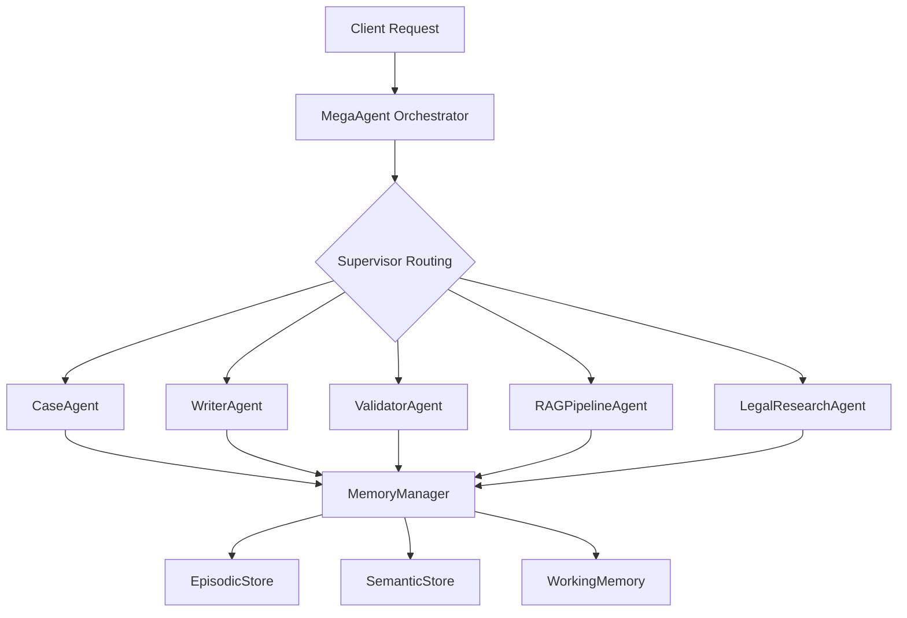

# README для агентов Claude Flow - mega_agent_pro

## 📋 БАЗОВАЯ ИНФОРМАЦИЯ

**Проект**: mega_agent_pro — Advanced Multi-Agent System для юридической сферы  
**Тип**: LangGraph/LangChain на основе асинхронного Python  
**Статус**: ✅ Основные агенты, воркфлоу и безопасность готовы; идёт расширение RAG и прод-профилей  
**Технологии**: Python 3.11+, LangGraph, Pydantic v2, PostgreSQL, Redis, Prometheus  
**База данных**: PostgreSQL (prod) / in-memory (dev)  
**Деплоймент**: Docker (мультистейдж образы), Docker Compose, Kubernetes манифесты (api/worker/bot)

## 🏗️ АРХИТЕКТУРА

### Общая схема проекта


### Ключевые компоненты

**1. Memory System (ГОТОВО)**
- `MemoryManager` - Фасад для всех типов памяти
- `EpisodicStore` - Хранение событий и аудита
- `SemanticStore` - Семантическое хранение фактов
- `WorkingMemory` - RMT буфер для контекста

**2. Orchestration Layer (РАСШИРЕННО)**
- `WorkflowState` / `EnhancedWorkflowState` — LangGraph состояние с мульти-агентной координацией
- `pipeline_manager` — управление checkpointing (in-memory/SQLite/Pinecone)
- `workflow_graph` и `enhanced_workflows` — маршрутизация log→reflect→retrieve→RAG→validation

**3. Agents (ГОТОВО / В РАБОТЕ)**
- `MegaAgent`, `SupervisorAgent`, `CaseAgent`, `WriterAgent`, `ValidatorAgent`, `RagPipelineAgent`
- EB1A-пакет: `EB1Agent`, `EB1EvidenceAnalyzer`, валидаторы/координаторы
- Подсистема обратной связи и self-correction (`FeedbackAgent`, `ValidatorExtensions`)

### Паттерны проектирования
- **Memory Pattern**: Трехуровневая система памяти (эпизодическая, семантическая, рабочая)
- **StateGraph Pattern**: LangGraph workflow с checkpointing
- **Facade Pattern**: MemoryManager как единая точка доступа
- **Protocol Pattern**: Embedder interface для гибкости

## 📁 ФАЙЛОВАЯ СТРУКТУРА

```
mega_agent_pro_codex_handoff/
├── app_demo.py                        # Асинхронный демо-сценарий LangGraph
├── api/                               # FastAPI слой (main/main_production, маршруты, auth)
├── config/                            # Pydantic settings + secrets manager + профили
├── core/
│   ├── groupagents/                   # Все агенты (MegaAgent, CaseAgent, RagPipelineAgent, WriterAgent…)
│   ├── memory/                        # MemoryManager v2, stores, policies, embedders
│   ├── orchestration/                 # Workflow graphs, pipeline manager, EB1A узлы
│   ├── rag/                           # Интегрированная RAG подсистема (ingestion, hybrid, rerank, context)
│   ├── security/                      # RBAC, prompt detector, audit trail, security config
│   ├── workers/                       # Асинхронный worker + CLI
│   └── observability/                 # Metrics, tracing, logging интеграция
├── deployment/                        # Docker/K8s скрипты, smoke-test
├── docs/                              # Гайды по EB1A, валидации, архитектуре
├── tests/                             # Unit/Integration/Workflows + новые smoke/секьюрити тесты
└── README*.md                         # Документация для агентов, мониторинга, миграций
```

**Легенда:**
- 🟢 **Готово** - Можно использовать
- 🟡 **Базовое** - Работает, но требует расширения
- 🔴 **Не реализовано** - Только в спецификации

## 📊 ТЕКУЩЕЕ СОСТОЯНИЕ

### ✅ Реализовано
- Многоуровневая память: DeterministicEmbedder для dev, Pinecone/Postgres адаптеры для prod, LangGraph интеграция.
- Агентный слой: MegaAgent + Supervisor/Case/Writer/Validator/EB1A/RAG/Feedback агенты со связью через EnhancedWorkflowState.
- Подсистема RAG: ingestion/hybrid/rerank/context, LangGraph-узлы RAGPipelineAgent, новые тесты.
- Безопасность: RBAC загрузчик из политики, Prompt Injection Detector с конфигурируемым порогом, immutable audit trail.
- Инфраструктура: Docker (api/bot/worker), Compose профиль worker, Kubernetes deployment, smoke-test скрипт.

### 🚧 В работе
- Расширение RAG коннекторов (внешние коллекции, Pinecone namespaces).
- Дополнительные workflow-шаблоны (fan-out/fan-in, error recovery) и прод-Launch плейбуки.
- Наращивание тестового покрытия для писем/валидации и нагрузочные сценарии.

### 🗺️ Дорожная карта
- Интеграция real-time уведомлений и human-in-the-loop.
- Полная замена placeholder-инструментов (http.get) на боевые реализации.
- Оптимизации производительности и комплексные наблюдаемость дешборды.

### 🐛 Известные особенности
1. Плейсхолдерные HTTP-инструменты и метрики — необходимые заглушки до внедрения реальных провайдеров.
2. RAG-пайплайн опирается на in-memory хранилище; для prod требуется миграция на Pinecone/Postgres.
3. Kubernetes yaml ожидает наличие секрета megaagent-secrets; необходимо синхронизировать с новым secrets manager.
## 🎯 СТАНДАРТЫ КОДА

### Стиль кодирования
```python
# Используется throughout:
from __future__ import annotations  # Для forward references

# Async-first подход
async def amethod_name(self, param: str) -> ReturnType:
    """Все методы ввода-вывода асинхронные"""
    pass

# Pydantic v2 стандарт
class Model(BaseModel):
    field: str = Field(..., description="Always provide descriptions")
```

### Naming Conventions
- **Classes**: PascalCase (`MemoryManager`, `WorkflowState`)
- **Methods**: snake_case с префиксом `a` для async (`alog_audit`, `aretrieve`)
- **Constants**: UPPER_SNAKE_CASE
- **Files**: snake_case (`memory_manager.py`, `workflow_graph.py`)

### Комментарии и документация
- Docstrings для всех public методов
- Type hints обязательны
- `# pragma: no cover` для import guards
- Inline комментарии для complex logic

### Тестирование (ПЛАНИРУЕТСЯ)
- pytest + pytest-asyncio
- Mocking для внешних зависимостей
- Contract tests для agent interfaces
- Integration tests для workflows

## 🚀 QUICK START для агентов

### 1. Понимание базовой системы
```python
# Изучить main workflow
python app_demo.py

# Изучить API памяти
from core.memory.memory_manager import MemoryManager
memory = MemoryManager()
```

### 2. Расширение workflow
```python
# Добавить новый узел в workflow_graph.py
async def node_my_feature(state: WorkflowState) -> WorkflowState:
    # Твоя логика
    return state

# Зарегистрировать в build_memory_workflow()
graph.add_node("my_feature", node_my_feature)
```

### 3. Создание нового агента
```python
# Использовать спецификацию из codex_spec.json
# Следовать паттернам из LANGGRAPH_ARCHITECTURE_PATTERNS.md
# Интегрировать с MemoryManager
```

## 📚 КЛЮЧЕВЫЕ ССЫЛКИ

- `codex_spec.json` - Детальная спецификация всех агентов
- `LANGGRAPH_MIGRATION_GUIDE.md` - План миграции на LangGraph
- `LANGGRAPH_ARCHITECTURE_PATTERNS.md` - Готовые паттерны кода
- `IMPLEMENTATION_CHECKLIST.md` - Пошаговый план реализации

## 🔧 ИНСТРУМЕНТЫ И ЗАВИСИМОСТИ

### Основные
```bash
pip install langgraph langchain pydantic[v2] asyncpg redis
```

### Опциональные (для full implementation)
```bash
pip install langchain-openai langchain-google-genai langchain-community
pip install fastapi uvicorn  # для API
pip install pytest pytest-asyncio  # для тестов
```

---

**Последнее обновление**: 2025-09-16
**Ответственный за документацию**: AI Development Team
**Следующий review**: По завершении Phase 1 implementation
